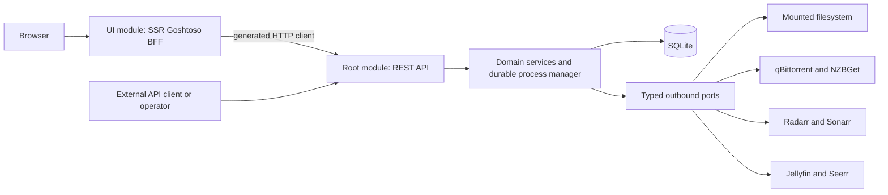

# Spec 001: media reconciliation

Status: future v0.0.1 contract, not implemented. User choices are recorded in the
[interview](../../product/interview.md). Engineering defaults and compatibility
questions are distinguished in [decisions](../../architecture/decisions.md).
Tasks live in the [implementation plan](../../plans/implementation.md), not here.

## Purpose and scope

Mastarr detects downloaded media, explains which external instances track it,
and executes reviewed actions to bring observed state into the user's chosen
state. It also lists Arr-tracked media with no matching download. Detection alone
never authorizes a mutation.

| ID | Requirement |
| --- | --- |
| R-01 | Scan one or many mounted download directories, manually and on per-directory schedules. Discover files even after client history disappears. |
| R-02 | Associate qBittorrent/NZBGet instance, client item, completion time, and original .torrent/.nzb when evidence exists. Preserve unknowns. |
| R-03 | List tracked media from every configured Arr instance. Distinguish registration, exact import, Jellyfin availability, and Seerr media/request status. |
| R-04 | Support movies, episodes, season packs, anime, and accompanying subtitles. Let users correct title, episode, and subtitle associations. |
| R-05 | Offer independent Arr registration/upsert, Arr import, direct library copy/hardlink, and extensible filesystem actions. |
| R-06 | Missing Arr titles need two approvals, registration followed by an exact import preview and approval. |
| R-07 | API owns durable actions and ordered workflows; BFF composes and presents them. Show partial progress, failed steps, current state, retries, and cancellation. |
| R-08 | Every action observes desired state first. Already satisfied succeeds without mutation; uncertain outcomes reconcile before retry. |
| R-09 | Move, rename, copy, hardlink, trash, restore, and explicit permanent deletion respect target type, mounts, permissions, and reviewed scope. |
| R-10 | Trash retains payload 30 days by default. Janitor purges expired entries. UI always trash then purge; API can explicitly hard delete. |
| R-11 | Expose seeding impact. Use native qBittorrent moves/renames when supported; stop before trash/delete, retain entry in trash, remove entry at permanent deletion. |
| R-12 | Multiple instances of every integration; explicit connection-scoped identities and path mappings. |
| R-13 | API/UI configuration plus read-only startup YAML; expose source. Encrypt directly entered credentials with a supplied or persistent generated key. |
| R-14 | Portable container deployment, SQLite/sqlc/golang-migrate, separate tools and UI Go modules, oapi-codegen REST, latest compatible released Goshtoso baseline. |
| R-15 | v0.0.1 has no application authentication. Basic auth and application OIDC belong to v0.0.2. Public repository uses MIT. |

Seerr is read-only in this release. Music, unrelated-title mixed packages,
indexer management, release searches, automatic approvals, a Kubernetes operator,
arbitrary DAG scripting, and automatic repair across managers are outside scope.
Category/tag automation can filter discovery, but cannot authorize imports.

## Topology and ownership

The API process also hosts the executor and scan scheduler. v0.0.1 supports one
active API/executor per database. The BFF is independently deployable and has no
filesystem media access. Ports describe application needs, with typed capability
results and errors. Domain code does not import upstream HTTP DTOs or SQL rows.
The filesystem port is intentional because filesystem operations are a product
boundary, not an abstraction added for hypothetical alternate storage.

The API validates all direct and composed actions. BFF recipes cannot bypass
approval, freshness, exact target checks, or capability checks. Every external
integration has a stable connection ID, product kind, configuration revision,
capabilities, observed version, health, and last successful coverage snapshot.

## Vocabulary and inventory

A discovery is an observed group of files in a watched directory. A download is
a client-scoped record that may relate to zero, one, or several discoveries.
A media identity is a provider ID and media kind; a display title is not identity.
An external registration is a title record in one Arr instance. An import is a
verified file association to that registration. Availability is a separate,
timestamped observation from Jellyfin or Seerr.

Each observed relationship carries evidence source, observedAt, coverage ID,
and confidence category: exact, suggested, ambiguous, or unknown. No floating
confidence score implies certainty. Client completion times are nullable and
kept separately from discoveredAt, fileModifiedAt, and firstSeenAt.

Tracking is per connection and dimension, with present, absent, or unknown value.
Absent requires fresh, complete relevant coverage. Stale positive observations
remain visible with their age; they are not fresh authority for a write. A timeout,
truncated list, missing permission, or disabled integration yields unknown.
Untracked is a filtered view where the selected tracking dimension is confirmed
absent across the selected managers. It is not a universal boolean stored on a file.

Queries combine discoveries and Arr catalogs without hiding unmonitored or missing
media. Two Arr instances tracking the same provider ID remain distinct records.
Provider IDs correlate Seerr/Jellyfin where available; title-only guesses remain
suggestions. Users choose the target instance explicitly if several qualify.

## Discovery behavior

A scheduled or manual scan creates a durable scan record with per-root progress,
coverage, errors, and timestamps. Scans read directories and client inventories;
they do not register titles, alter categories/tags, or transfer files. Limit one
active scan per root; coalesce another trigger into one follow-up scan.

Ignore application-owned trash/staging and reject traversal outside configured
roots. Do not follow symlinks. Present unsupported entries with a reason. A file
still downloading, extracting, unpacking, or changing is visible but not ready.
Client-reported completion and file stability are separate checks. Orphan files
require stability observations and explicit review; stability never proves no
other process will write later.

Video discovery includes common video containers; subtitle detection includes
SRT, ASS, SSA, VTT, and paired IDX/SUB. Parser recognition does not guarantee
playability. Unsupported extensions remain visible as companions requiring
classification. Archive extraction and transcoding are not performed by Mastarr.
Season packs expand into individually reviewable video/episode associations.
Anime absolute numbering stays unresolved until the chosen Sonarr mapping is
confirmed. Unmatched subtitles remain visible and are never silently discarded.

Descriptor retrieval is best effort through supported client capabilities or an
explicitly configured, mounted descriptor directory. Store the original bytes
when obtainable, plus digest and provenance. A client display name does not prove
an original descriptor exists. Descriptor retention survives payload purge and
is explicit; see [data and recovery](data-and-recovery.md).

## Review and actions

An action plan is immutable, revisioned desired state with exact inputs,
preconditions, target connection/config revisions, file manifest, impacts,
capability evidence, and expiry. Creating it is read-only toward media systems.
Approval refers to that saved revision. Changed inputs create a new revision.

| Action | Review contents | Success predicate |
| --- | --- | --- |
| Arr registration/upsert | Provider identity, target instance, changed fields, root/profile, monitoring | Read-back title identity and every explicitly desired field match |
| Arr manual import | Exact video/subtitle paths, movie or episode IDs, quality/language, native rejections, transfer behavior | Expected Arr file associations and destination evidence verified |
| File copy | Source identity/content, exact destination, byte/space cost | Destination content verified; source preserved |
| File hardlink | Source identity, destination, same-filesystem support | Both paths refer to the same file object; no copy fallback |
| Move/rename | Old/new path, native client operation if linked, affected external references | Destination identity/content verified and old selected path absent |
| Trash | Exact manifest, client stop, affected references, restore location, purge time | Selected payload in recorded trash location and client stopped |
| Restore | Trash manifest, destination conflicts, client state | Selected payload restored; client remains stopped by default |
| Permanent delete | Exact payload/descriptor scope, irreversible effect, associated torrent records | Selected objects absent and required torrent records removed |
| Jellyfin refresh | Chosen instance and supported library/item refresh scope | Refresh acceptance reported separately from later observed availability |

Title upsert is a field-level patch, not replacing an upstream object. Supported
fields are selected root, quality profile, monitoring, and Sonarr series type,
season-folder preference, and explicitly selected season/episode monitoring where
supported. Unspecified existing fields remain unchanged. New registrations default
to unmonitored. No registration launches an automatic release search. Monitoring
opt-in explicitly explains possible later Arr acquisition and upgrades.

The composed workflow includes subtitle actions by default and lists their exact
scope. A single-file API action never silently includes nearby files. If Arr does
not reliably import a companion, a separate reviewed companion placement step is
required. Do not execute a combined workflow under an unverified assumption about
upstream subtitle behavior.

Unknown-title flow:

1. Review identity and registration fields. Approve registration plan only.
2. Execute or observe already-satisfied registration; save read-back evidence.
3. Build the exact import preview against that registration. Stop for a second approval.
4. Execute and verify import, then separately observe or request supported Jellyfin refresh.
5. Observe Seerr on its own schedule. Do not create a Seerr request to mark media available.

Already-registered titles skip registration mutation but still need exact import
approval. Library-only placement requires no Arr registration. Copy/hardlink to
a configured library destination and optional Jellyfin refresh form their own
reviewed sequence. Their success does not imply Arr or Seerr tracking.

## Conflicts and filesystem scope

No action silently overwrites an existing destination. Same desired content or
object can be already satisfied only under the action's evidence predicate.
Conflicts return to review. Selected v0.0.1 resolution is another destination or
an explicit trash-existing step followed by placement, with each effect shown.
Native Arr replacement of an existing library file is not enabled merely because
the user approved a new import. Arr overwrite guarantees remain a compatibility
gate in [connectors](connectors.md).

Directory actions bind an enumerated child manifest and reject root-directory
operations, special files, traversal, changed children, and unreviewed recursion.
Directory hardlinks are unsupported. Cross-filesystem move or trash requires an
explicit copy-verify-delete sequence and space preview; it is never an implicit
fallback. Capability changes return remaining steps to review.

A partial torrent selection stops the entire associated torrent. Permanent delete
removes that torrent's client record but deletes only the approved payload subset.
The preview names remaining payload and its lost client tracking. Keep manifests
and torrent identifiers needed by other trash entries. Restore does not re-add a
removed torrent or resume seeding automatically. Arr/Jellyfin references affected
by file operations are reported; automatic coordinated repair is not promised.

## Durable execution and invariants

Ordered steps and approval gates cover v0.0.1. API-side process state survives BFF
exit, browser close, and restart. Each step records attempts, observations,
completed effects, unresolved effects, and retry eligibility. Exact states and
crash behavior are specified in [data and recovery](data-and-recovery.md).

| ID | Invariant |
| --- | --- |
| I-01 | Discovery and preview cause zero media-system writes. |
| I-02 | No executable step exceeds its immutable approved manifest or desired fields. |
| I-03 | Registration approval cannot authorize the later exact import. |
| I-04 | HTTP accepted, upstream completed, imported, and available are independently evidenced. |
| I-05 | Unknown/partial/stale evidence never becomes a fresh absence or safety claim. |
| I-06 | Already-satisfied actions produce zero new external effects. |
| I-07 | No silent overwrite, transfer fallback, source deletion, or recursive scope expansion. |
| I-08 | An uncertain write is reconciled read-only before any mutation retry. |
| I-09 | Cancellation prevents future dispatch but does not claim rollback of accepted effects. |
| I-10 | File-owned config is read-only in API/UI; changed intent invalidates affected plans. |
| I-11 | Purge cannot remove unselected payload; qBittorrent record removal uses no payload deletion. |
| I-12 | BFF can neither bypass API validation nor access persistence/upstream clients directly. |
| I-13 | Secrets and descriptors are absent from ordinary responses, logs, public fixtures, and previews. |

## Operational limits and observability

Initial design targets a single active API/executor, Linux OCI images for amd64
and arm64, one SQLite database on storage supporting its locking/durability needs,
and bounded network/filesystem concurrency. Multiple integration instances do not
imply HA support. Actual capacity and minimum upstream versions require measured
acceptance evidence; no throughput claim is made by this spec.

Expose liveness, readiness, connection health, scan coverage, work queue age,
retry reason/next attempt, attempt duration, trash backlog, and migration/key
startup failures. Structured logs identify action/attempt/connection IDs without
credentials, descriptors, private URLs, or raw upstream bodies. Audit records
store reviewed scope and effects with unauthenticated attribution in v0.0.1.
Private runtime paths belong in authorized inventory responses, not metrics labels.
Errors follow the [HTTP contract](http-api.md). Configuration and deployment
constraints are specified in [configuration](configuration.md).
